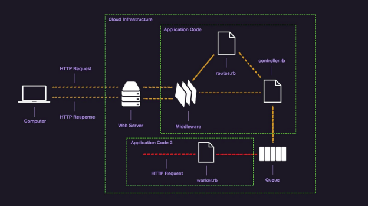

<!-- @format -->

# README

- Installation and setup

  - using Docker composer to build and run the application

  ```
  cd development && docker-compose build && docker-compose up
  ```

  - create the database and migration from the development directory

  ```
  docker-compose run web rails db:create && docker-compose run web rails db:migrate

  ```

- Docker composer will create 6 containers

  - web [Ruby on Rails] Rest API
  - db [mysql] database
  - redis [redis] cache
  - sidekiq [sidekiq] background jobs
  - elasticsearch [elasticsearch] search engine
  - kibana [kibana] search engine dashboard

# API documentation

### Elastic search search Api

```
- End point: http://localhost:3000/api/v1/messages/search/:query/?application_token=7d9ff754f6b4143e5386&chat_number=12

- Method: GET

- Params:

  - query: search query
  - application_token: application token
  - chat_number: chat number

- Response:

{
"result": [
"zico max 2 lol"
]
}
```

### Application Api

- create Application

```
  Method : POST
  Url    : http://localhost:3000/api/v1/appapplications
  Example:
	Body
	{
		"name" :"test"
	}
	Response:
	{
		token : "da27a6be03637ae2bd7b"
	}

```

- get specific Application

```
	Method : GET
	Url    : http://localhost:3000/api/v1/applications/:token
	Example:
	Response:
{
    "token": "2576d3998967f5466478",
    "name": "test01 update",
    "chats_count": 0
}

```

- update Application

```
	Method : PUT
	Url   : http://localhost:3000/api/v1/appapplications/:token
	Example:
	Body
	{
		"name" :"test1 updated"
	}
	Response:
{
    "token": "2576d3998967f5466478",
    "name": "test01 update"
}

```

- delete Application

```
	Method : DELETE
	Url    : http://localhost:3000/api/v1/appapplications/:token
	Example:
	Response:
	{
		token : "da27a6be03637ae2bd7b"
	}

```

### Chat Api

- create chat with application token and chat name

```
	Method : POST
	Url    : http://localhost:3000/api/v1/chats
	Example:
	Body
	{
		"application_token" :"da27a6be03637ae2bd7b",
		"name" :"test chat"
	}
	Response:
	{
		  "chat_number": 2,
    "application_token": "da27a6be03637ae2bd7b"
	}

```

- get specific chat for specific application

```
	Method : GET
	Url    : http://localhost:3000/api/v1/chats/:chat_number?application_token=da27a6be03637ae2bd7b
	Example:
	Response:
	{
		"chat": {
        "number": 2,
        "name": "chat 2 test create"
    },
    "application_token": "2bdd678063010adc6ac4"
	}

```

- get all chats for specific application

```
	Method : GET
	Url    : http://localhost:3000/api/v1/chats?application_token=da27a6be03637ae2bd7b
	Example:
	Response:
{
    "chats": [
        {
            "name": "chat 3 test create",
            "number": 1,
        },
        {
            "name": "chat 2 test create",
            "number": 2,
        },
        {
            "name": "chat 3 test create",
            "number": 3,
        }
    ],
    "application_token": "2bdd678063010adc6ac4"
}

```

### Messages Api

- create new message

```
	Method : POST
	Url    : http://localhost:3000/api/v1/messages
	Example:
	Body
	{
		"application_token" :"da27a6be03637ae2bd7b",
		"chat_number" : 1,
		"body" : "test message"
	}
	Response:
	{
    "message_number": 3,
    "application_token": "b8b403f18849c6a4718a",
    "body": "zico max 4",
    "chat_number": 1
	}
```

- get all Messages for specific chat

```
	Method : GET
	Url    : http://localhost:3000/api/v1/messages?application_token=da27a6be03637ae2bd7b&chat_number=1
	Example:
	Response:
	{
    "messages": [
        {
            "number": 1,
            "body": "message 1",
        },
        {
            "number": 2,
            "body": "message 2",
        },
        {
            "number": 3,
            "body": "message 2",
        }
    ],
    "application_token": "d7e8048095db560a7ae9",
    "chat_number": 1
}

```

> Note : i first used sidekiq and redis for background jobs and caching but i found it was not the best solution for this project as i can't render json in background jobs and i can't cache the json response and return [,number ] when create



- chats and messages

> so i decided to use transctions and save the messages in the database and then render the json response

> OR use locks and save the messages in the database and then render the json response
